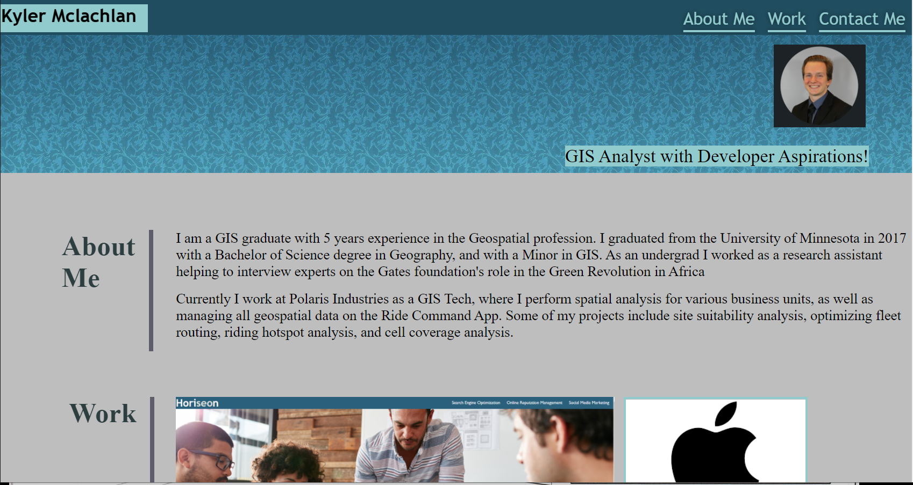

# Description

This project is my first attempt at making a website portolio. The portfilio showcases some of my projects as well as ways to contact me. The projects highlighted in the project include a refactoring of a test website as well as two stand in projects to be replaced at a later date.  

# Deploying

If you wish to view the project simply click on the link below the image. Feel free to pull the repository (also linked below) if you wish to view the codebase. Thanks and please reach out to the email listed at the end of the document with any questions!

# Image of website

# Link to website

https://kyler-mclachlan.github.io/Kyler-Mclachlan-Portfolio/

# Link to Repository 

https://github.com/Kyler-Mclachlan/Kyler-Mclachlan-Portfolio

# Contributors 
Kyler Mclachlan 
Sepideh Ayani 

# Questions 

Any questions about the code may be sent to Kyler.mclachlan@gmail.com